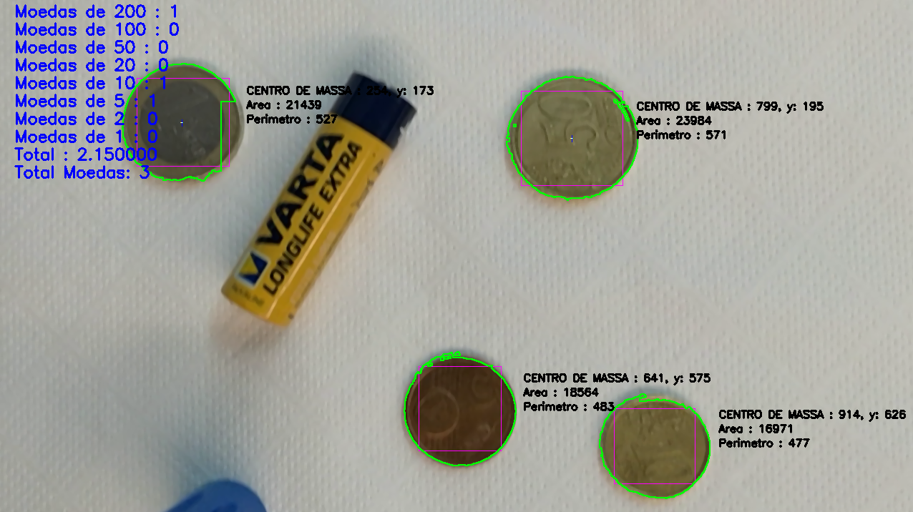
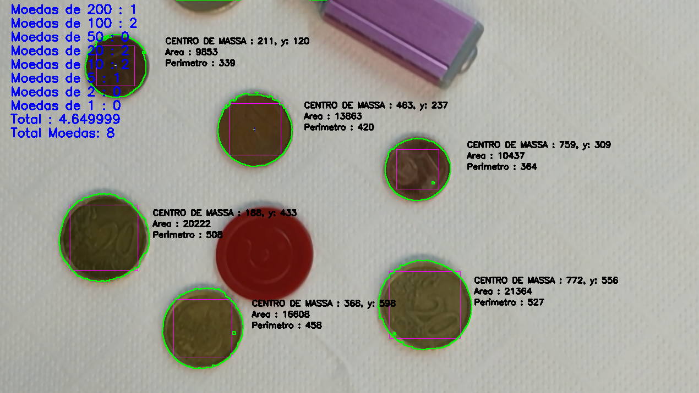

# Coin Quantifier

This project implements a C application that automatically detects and counts euro coins in provided video files. It analyzes each frame to identify coins by denomination, computes their areas and perimeters, and overlays bounding shapes and centroids in real time.


> **Academic Context**  
> Developed as part of the “Computer Vision” course in the second year of the degree in Computer Systems Engineering (2024/2025) at Instituto Politécnico do Cávado e do Ave.

## 🎯 Objectives

1. Read an input video (`*.mp4`) specified by the user.  
2. Detect all visible coins in each frame.  
3. Compute and display, during or after processing:  
   - Total number of coins observed.  
   - Count of each coin type (1 ¢, 2 ¢, 5 ¢, 10 ¢, 20 ¢, 50 ¢, €1, €2).  
   - Area and perimeter (in pixels) of every detected coin.  
   - Overlay on the video feed: bounding box, centroid, and coin denomination label.

## 🛠️ Technologies

- **Language:** C  
- **Library:** OpenCV C 

## 🚀 How to Run 

1. **Install dependencies:**

   ```bash
   sudo apt install libopencv-dev build-essential cmake

2. **Compile te program:**

   ```bash
   g++ -std=c++17 Source.cpp colors.c edge.c labelling.c morphOp.c utils.c vc.c -o coin-quantifier `pkg-config --cflags --libs opencv4`

3. **Run the program:**

   ```bash
   ./coin-quantifier

## 📷 Images





